# 🌿 Awesome Carbon Accounting Platform Ecosystem

    

 

 

**Curated Directory of Enterprise SaaS Solutions & Open-Source GHG Emission Calculation Tools**  
*Focused on GHG Emissions Tracking, Carbon Footprint Accounting, CSRD Disclosures & Net-Zero Target Setting*

**Last updated: September 2026**

---

## 🎯 Overview & Scope

This repository provides a comprehensive, curated index of **commercial SaaS platforms** and **open-source developer engines** designed for corporate **Carbon Accounting**, **GHG Footprint Calculation**, and **Sustainability / ESG Compliance**.

These platforms empower enterprise sustainability managers, ESG analysts, carbon accountants, and software developers to measure, track, allocate, and report greenhouse gas (GHG) emissions across **Scope 1 (Direct)**, **Scope 2 (Indirect Energy)**, and **Scope 3 (Supply Chain & Value Chain)** categories in accordance with international standards such as **GHG Protocol**, **ISO 14064**, **CSRD**, **CDP**, **TCFD**, and **SEC Regulations**.

---

## 📋 Table of Contents

- [🏢 SaaS & Commercial Platforms](#-saas--commercial-platforms)
- [🔓 Open-Source GitHub Projects](#-open-source-github-projects)
- [💡 Architectural & Implementation Guide](#-architectural--implementation-guide)
- [🤝 How to Contribute](#-how-to-contribute)
- [🛡️ Disclaimer](#-disclaimer)

---

## 🏢 SaaS & Commercial Platforms

📈 **Market Size & Industry Structure**: The global carbon accounting software market size is estimated at **$15.4 Billion to $26.8 Billion by 2030** (expanding at a compound annual growth rate CAGR of ~22.5%). The sector is currently **moderately-to-highly fragmented**, driven by competing multi-billion-dollar enterprise CRM giants (Salesforce, IBM, Sphera) alongside fast-growing specialized climate-tech category leaders (Watershed, Persefoni, Sweep, Greenly), accelerated by mandatory CSRD, SEC, and California SB 253/261 regulatory disclosures.

*The table below compares commercial carbon management platforms, sorted descending by company size / market valuation.*

| SaaS Platform 🚀 | Description & Core Focus 🎯 | Company Size (Valuation / Revenue) 🏢 | Pricing (Starting Tier) 💰 | Free Tier / Free Trial Limits 🎁 |
| :--- | :--- | :--- | :--- | :--- |
| **[Salesforce Net Zero Cloud](https://www.salesforce.com/)** | CRM-integrated enterprise sustainability management & automated Scope 1-3 GHG accounting platform. | **$250 Billion+** Valuation *(Parent Revenue: ~$35B/yr)* | **$48,000 / year** (Starter Org tier) | **30-day Free Trial** (Full sandbox trial org with sample datasets) |
| **[IBM Envizi](https://www.ibm.com/products/envizi)** | Enterprise suite for automated GHG data collection, ESG reporting & supply chain footprinting. | **$200 Billion+** Valuation *(Parent Revenue: ~$62B/yr)* | **$30,000 / year** (Essentials account bundle) | **30-day Free Trial** (For Emissions Calculations Excel plugin) |
| **[Watershed](https://watershed.com/)** | Enterprise climate platform for audit-grade carbon accounting, CSRD disclosures & decarbonization strategy. | **$1.8 Billion** Valuation *(Series C, ~$50M ARR)* | **$50,000 / year** (Enterprise contract starting tier) | **Free Open CEDA Access** *(Core software: demo/paid pilot)* |
| **[FigBytes](https://www.figbytes.com/)** | Comprehensive ESG management, carbon accounting & water stewardship platform (by AMCS Group). | **$1.5 Billion+** Parent Valuation *(Acquired by AMCS)* | **$20,000 / year** (Per-facility multi-entity tier) | **14-day Free Sandbox Demo** (Guided trial upon sales request) |
| **[Sphera](https://sphera.com/)** | ESG performance software featuring carbon accounting, product Life Cycle Assessment (LCA) & compliance. | **$1.4 Billion** Valuation *(Acquired by Blackstone)* | **$16,000 / year** (Standard annual module tier) | **45-day Free Trial** (Specifically for LCA for Experts tool) |
| **[Persefoni](https://persefoni.com/)** | Climate management & accounting platform (CMAP) for enterprise carbon footprinting and disclosures. | **$300 Million** Valuation *(Total Raised: $190M)* | **$55,000 / year** (Advanced Enterprise tier) | **Persefoni Pro (Free Forever)** (SME self-serve, all 3 GHG scopes) |
| **[Sweep](https://www.sweep.net/)** | Carbon & ESG data network platform for enterprise decarbonization, supplier tracking & Scope 3 audit trails. | **$300 Million** Valuation *(Total Raised: $100M)* | **$3,000 / year** ($250/mo growth tier) | **14-day Free Sandbox Trial** (Available upon sales request) |
| **[Greenly](https://greenly.earth/)** | Automated carbon accounting platform designed for SMEs & mid-market companies with bank integration. | **$150 Million** Valuation *(Total Raised: $75M)* | **$1,950 / year** (Starter plan for small businesses) | **Free Interactive Calculators** *(Core app: guided 7-day demo)* |
| **[SINAI Technologies](https://www.sinaitechnologies.com/)** | Decarbonization intelligence platform & marginal abatement cost curve (MACC) financial forecasting. | **$100 Million** Valuation *(Total Raised: $39.2M)* | **$25,000 / year** (Enterprise planning module tier) | **14-day Free Guided Pilot** (Available upon request) |
| **[Plan A](https://plana.earth/)** | Corporate ESG management & carbon accounting software with automated CSRD & ESG report builder. | **$64 Million** Valuation *(Acquired by Diginex)* | **$3,200 / year** (€3,000/yr SME starting plan) | **Free Carbon Footprint Calculator** *(Platform: 14-day demo)* |
| **[CarbonChain](https://www.carbonchain.com/)** | Automated supply chain carbon accounting specialized for metals, energy, trade finance & manufacturing. | **$60 Million** Valuation *(Total Raised: $14.2M)* | **$12,000 / year** (Commodity tracking tier) | **14-day Free Trial** (For CBAM carbon tax compliance tools) |
| **[Emitwise](https://www.emitwise.com/)** | Scope 3 supply chain carbon accounting engine & automated supplier carbon engagement portal. | **$50 Million** Valuation *(Total Raised: $17M)* | **$15,000 / year** (Supply chain starting tier) | **14-day Free Trial** (Supplier engagement module trial) |

---

## 🔓 Open-Source GitHub Projects

*Open-source engines provide transparent calculation logic, local-first data processing, custom emission factor mapping, and specialized carbon accounting frameworks. Sorted descending by GitHub star count.*

- **[CodeCarbon](https://github.com/mlco2/codecarbon)**  — **1,923 ⭐**  
  *Python package for tracking & estimating CO₂ emissions produced by compute infrastructure, cloud instances, and machine learning model training workloads.*

- **[Cloud Carbon Footprint](https://github.com/cloud-carbon-footprint/cloud-carbon-footprint)**  — **1,052 ⭐**  
  *Open-source multi-cloud framework to measure, track, and visualize energy consumption and CO₂e emissions across AWS, Google Cloud, and Microsoft Azure.*

- **[PUDL (Public Utility Data Liberation)](https://github.com/catalyst-cooperative/pudl)**  — **610 ⭐**  
  *Open data pipeline liberating energy system data, US utility statistics, and hourly grid emissions metrics for climate advocacy, research, and accounting.*

- **[CO2.js](https://github.com/thegreenwebfoundation/co2.js)**  — **497 ⭐**  
  *JavaScript library from The Green Web Foundation to calculate digital carbon footprints of websites, microservices, and apps using Sustainable Web Design Models (SWDM).*

- **[CarbonTracker](https://github.com/saintslab/carbontracker)**  — **483 ⭐**  
  *Python framework to monitor, predict, and log energy consumption and carbon footprints during machine learning model training sessions.*

- **[Eco2AI](https://github.com/sb-ai-lab/Eco2AI)**  — **280 ⭐**  
  *Python library tracking power consumption, equivalent CO₂ emissions, and regional electric grid carbon intensity during program execution.*

- **[ecoCode](https://github.com/green-code-initiative/ecoCode)**  — **216 ⭐**  
  *SonarQube static analysis plugin designed to reduce software energy usage and carbon footprint by identifying inefficient code structures in Java, Mobile, and Web projects.*

- **[Open Grid Emissions](https://github.com/singularity-energy/open-grid-emissions)**  — **93 ⭐**  
  *High-quality hourly power generation and Scope 2 electric grid emissions data processing pipeline for US power regions by Singularity Energy.*

- **[WRI Carbon Budget](https://github.com/wri/carbon-budget)**  — **88 ⭐**  
  *World Resources Institute (WRI) spatial accounting tool calculating global forest carbon sequestration removals, gross GHG emissions, and net land flux.*

- **[OS-Climate PhysRisk](https://github.com/OS-Climate/physrisk)**  — **69 ⭐**  
  *Microservice engine for climate physical risk modeling, asset hazard vulnerability assessment, and financial climate risk accounting.*

- **[CityCatalyst](https://github.com/Open-Earth-Foundation/CityCatalyst)**  — **44 ⭐**  
  *Open-source municipal carbon accounting platform for urban climate action planning, developed by Open Earth Foundation.*

- **[e-footprint](https://github.com/Boavizta/e-footprint)**  — **19 ⭐**  
  *Open-source python toolkit for modeling full lifecycle environmental impact and LCA carbon emissions across servers, hardware, storage, and networking devices.*

- **[EPFL CO₂ Calculator](https://github.com/epfl-enac/co2-calculator)**  — **6 ⭐**  
  *GHG Protocol compliant carbon footprint calculation web tool developed at EPFL for institutional, academic, and lab carbon accounting.*

- **[CarbonInk](https://github.com/lxzxl/carbonink)**  — **3 ⭐**  
  *Desktop local-first ISO 14064-1 GHG inventory application (macOS/Windows) with offline AI receipt/bill document extraction and built-in MCP server.*

- **[beru](https://github.com/rmrt1n/beru)**  — **2 ⭐**  
  *Lightweight Svelte-based corporate carbon accounting web app implementing the financial e-liability GHG accounting methodology.*

- **[carbonpredict](https://github.com/david-leake/carbonpredict)**  — **1 ⭐**  
  *R package (CRAN) predicting Scope 1, 2, and 3 carbon emissions for UK SMEs using Standard Industrial Classification (SIC) codes and annual revenue data.*

- **[GreenOps](https://github.com/cherryaugusta/greenops-carbon-accounting-platform)**  — **0 ⭐**  
  *Full-stack Django & React ESG platform with travel and energy tracking, audit history, drag-and-drop report builder, and Docker Compose setup.*

- **[OpenGHG](https://github.com/mindsongreen/OpenGHG)**  — **0 ⭐**  
  *Transparent PHP & PostgreSQL carbon footprint calculator featuring federated data architecture, explicit unit algebra, and formula auditability.*

---

## 💡 Architectural & Implementation Guide

When choosing between commercial SaaS platforms and open-source frameworks:

1. **Desktop & Local-First GHG Inventory**: For offline-capable ISO 14064-1 accounting with AI document extraction, **[CarbonInk](https://github.com/lxzxl/carbonink)** provides an offline desktop workflow.
2. **Compute & Machine Learning Footprinting**: For AI/ML model training and cloud workload emissions, **[CodeCarbon](https://github.com/mlco2/codecarbon)** and **[Cloud Carbon Footprint](https://github.com/cloud-carbon-footprint/cloud-carbon-footprint)** offer standardized CO₂ tracking libraries.
3. **Web & Digital Service Footprinting**: For estimating digital product carbon footprints, **[CO2.js](https://github.com/thegreenwebfoundation/co2.js)** and **[e-footprint](https://github.com/Boavizta/e-footprint)** provide SWDM model implementations.
4. **Full-Stack Web ESG Development**: For customizable full-stack solutions, **[GreenOps](https://github.com/cherryaugusta/greenops-carbon-accounting-platform)** and **[OpenGHG](https://github.com/mindsongreen/OpenGHG)** provide complete database schemas and approval workflows.
5. **Enterprise CSRD & Regulatory Disclosures**: Full corporate carbon accounting with automated multi-ERP data ingestion, supplier Scope 3 engagement portals, and regulatory disclosures (CSRD, SEC, CDP) remains primarily driven by commercial enterprise platforms like **Salesforce Net Zero Cloud**, **IBM Envizi**, **Watershed**, and **Persefoni**.

---

## 🤝 How to Contribute

Contributions are highly appreciated! To submit a new SaaS platform or open-source carbon accounting project:

1. 🍴 **Fork** this repository.
2. 📝 **Add/Update** entries in `README.md` following the established table / list format.
3. 🔗 Include exact project name, link, factual description, starting price / star count, and category.
4. 🚀 **Open a Pull Request** with a brief summary of the added project.

---

## 🛡️ Disclaimer

- This directory is a **community-curated resources list** provided for educational and research purposes.
- Inclusion does not constitute an endorsement, official certification, or audit assurance.
- Organizations implementing carbon accounting software must verify compliance with applicable regional reporting standards (e.g. GHG Protocol, ISO 14064, CSRD, SEC).

---

**Made with 💚 for sustainability leaders, carbon accountants, ESG analysts & climate developers.**  
*Let's build a transparent, auditable, and open net-zero future.*

